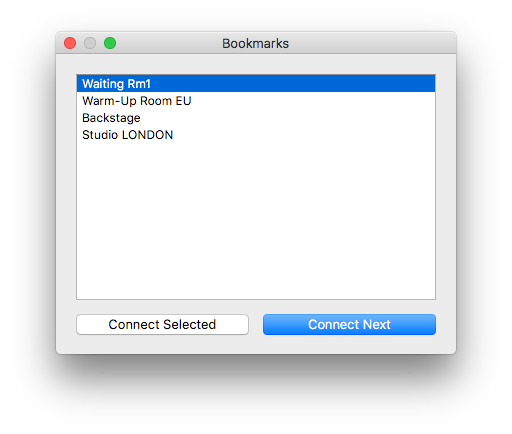
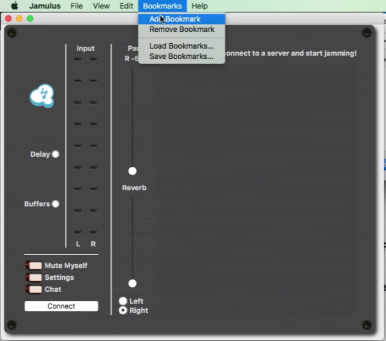

## Jamulus 3.7.0.Bookmarks

## Note: This is not an official release! For official releases please visit <https://jamulus.io>
## This is a patch on the 3.7.0. stable release.

# [Download Windows Installer](https://github.com/geotechfirst/jamulus/releases/download/r3_7_0_bm1/Jamulus-3.7.0.bookmarks-installer-win.exe)

# [Download Mac OS dmg](https://github.com/geotechfirst/jamulus/releases/download/r3_7_0_bm1/Jamulus-3.7.0.bookmarks-installer-mac.dmg)

# [Download Source Code](https://github.com/geotechfirst/jamulus/archive/refs/heads/r3_7_0-patch.zip)

# How does it work?

- The **Bookmarks** dialog is hidden by default, it will show if you either **Add bookmark** or **Load bookmarks** file.
- To add a bookmarks you need to connect to a server first. Then click add bookmark.
- To load bookmarks click on the menu item

# Story behind this patch

- During WorldJam performances performers need to change servers multiple times. Using the currently available method this is not convenient.
- Sound engineers and other organisers need to move around a lot too.
- Most of these transitions are pre-defined and lists can be generated to provide a convenient path through the process.
